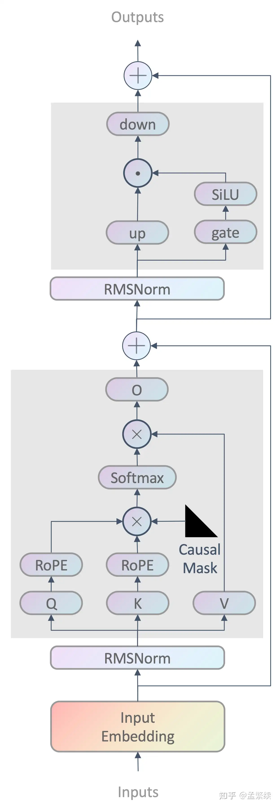
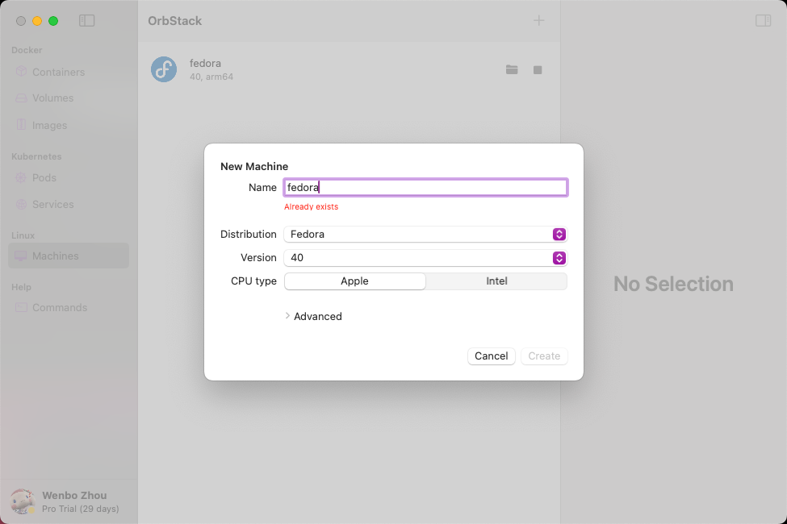
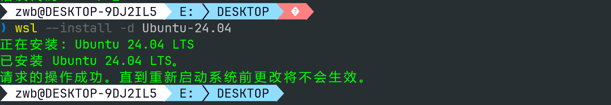

# 实验简介
随着chatGPT的出现，大模型飞速发展，越来越多的模型开源，模型推理的框架也层出不穷。其中LLaMA模型是Meta公司开源的一系列预训练语言模型，广泛应用于自然语言处理任务。
为了体验模型的推理过程，助教写了一个简单的推理程序，可以基于FP32精度的LLaMA模型进行推理。
但是由于助教的经验不足，在代码里面引入了一些bug，需要同学们帮忙debug。

# 实验目标
- 学习Llama模型的推理过程
- 编写测试代码，测试程序的正确性
- 利用代码分析工具，如GDB、ASAN等，找到程序的bug，并且修复

# Llama模型推理过程
<div align="center"></div>

为了方便同学们理解Llama模型的推理过程，下面简单介绍一些相关的知识，模型推理的过程主要包括：
- 模型加载
- 输入Prompt编码
- 模型推理
- 输出解码

其中模型推理的部分是核心，参考代码的generate函数，会将输入的prompt编码成一系列的tokens，然后依次处理每一个token，并产生新的token，这部分代码可以参考forward函数。

本实验是以Llama2的结构进行推理，需要同学们理解其模型结构。

[Llama2](https://zhuanlan.zhihu.com/p/636784644)的模型结构如上方图片所示。

图中每一个模块都是一次运算，称为算子，比如RMSNorm，Softmax，MatMul等。

模型文件为`.gguf`格式，其中存放的是这些算子的权重，以及一些模型信息。而模型框架要做的就是读取模型文件，并执行这些算子。本实验不会涉及非常深入的代码逻辑，但是还是需要同学们理解代码的大体流程。

# 实验要求
- 实验的核心代码都在src目录下，其中main.cpp是程序的入口，本次实验中可能出现的bug都在core.cpp中，src中其他文件的代码大家可以默认是正确的，最后提交的代码文件只需要提交你修改过的core.cpp文件
- 本实验可能会遇到segmentfault、memory leak、use after free等bug，需要大家使用GDB和Asan来进行debug，并且修复
- 本次实验不允许对代码作大面积的修改，具体限制如下：大家的代码每行不能超过 **100 个字符**，且不能和原始代码相差超过 **80 行**。我们会使用 Unix diff 工具来比较你上传的 core.cpp 和原始的 core.cpp，如果你的代码和原始代码相差超过 80 行，那么评测报错。
- 在线评测将只会检查编译问题和diff行数。在实验截止提交后，我们将会对你的代码进行充分的评测，以检查你的代码是否真的修复了BUG。我们的评测分为多个部分，如果你只修复了一部分BUG，也可能得到部分分数。
- Linux/Mac用户可以使用下面的命令来检查diff：

```bash
diff core.cpp core-orig.cpp | grep -cE '^[<>]'
```

- Windows用户可以使用PowerShell命令来检查diff：

```powershell
(Compare-Object (Get-Content ./core.cpp) (Get-Content ./core-orig.cpp)).Length
```

- 或者使用src目录下面的python脚本 diff.py 来检查，这是在线评测时用的脚本：

```bash
python3 diff.py -r core-orig.cpp -s core.cpp
```

# 提交文件
你需要提交一个**7z压缩包**，包含两个文件：

- `core.cpp`：修复后的源文件
- `report.pdf`：实验报告，包含以下内容：
  - 你是如何进行测试的
  - 你发现的BUG的类别
  - 你是如何发现这些BUG的
  - 你是如何修复这些BUG的
- 这两个文件应当放在压缩包的根目录下。请不要在压缩包内创建任何子目录

# 项目构建和执行
【请打开 `handout.md` 文件复制命令，不要直接从 PDF 中复制】

```bash
cmake -B build -S ./ -DCMAKE_EXPORT_COMPILE_COMMANDS=1 -DCMAKE_BUILD_TYPE=RelWithDebInfo -DENABLE_SANITIZERS=OFF
cmake --build build --config RelWithDebInfo

./build/src/run --file-path <file-path> --prompt <prompt> --steps <steps>
```
## example
使用助教提供的模型文件，模型链接参见Canvas作业详情。下载模型，放到项目的model目录下（model目录不存在可以手动创建），运行程序：
```bash
# 正确的输出
> ./build/src/run --file-path ./model/TinyLlama-1.1B-Chat-v1.0-F32.gguf --prompt "One day," --steps 20
 One day, a young woman named Lily woke up to find herself in a strange world.
```

# 环境配置
- 本实验需要用到一些额外的代码检查工具，建议将环境设置为Linux，在windows和mac上可以安装虚拟机进行实验

## MAC
- 安装虚拟机 orbstack：https://orbstack.dev
- 打开orbstack，创建一个Linux环境，发行版（Distribution）选择Fedora，版本（Version）选择40，修改内存上限，建议8GB以上
<div align="center"></div>

- 打开终端，输入 orb，进入虚拟机，更新软件包，安装工具
```bash
sudo dnf update -y
sudo dnf install -y gcc-c++ gcc make cmake
```

## Windows
- 参考链接：https://learn.microsoft.com/en-us/windows/wsl/install
- 安装常见错误解决方法：https://blog.csdn.net/wangaolong0427/article/details/124213873
- 打开powershell，查看电脑支持的wsl发行版版本：`wsl --list --online`
- 安装wsl2，发行版选择最新版ubuntu（下图中是Ubuntu-24.04），安装好重启电脑: `wsl --install -d Ubuntu-24.04`
<div align="center"></div>

- 第一次打开ubuntu，会提示你设置用户名和密码
- 在ubuntu的终端中，更新软件包，安装工具

```bash
sudo apt update -y
sudo apt install -y g++ gcc make cmake
```
