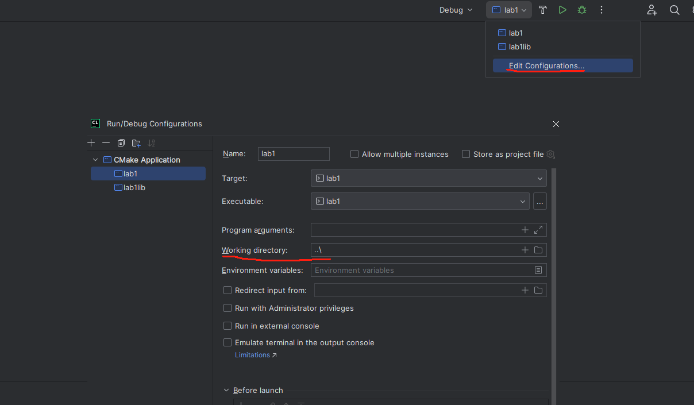

# Lab1: X老师的小程序

[toc]

X老师需要一个统计和计算学生成绩的小程序，以协助他录入学生成绩、统计课程分数以及查看学生的学分绩。
学生名单、课程列表和学生的选课情况已经存在于文本文件中，小程序需要从这些文件中读出内容并建立相应的对象，以完成后续的成绩录入和计算工作。

学生名单存在于文件 `Students.txt` 中，其中学生分为本科生（Undergraduate）和研究生（Graduate），分别以字母 `U` 和 `G` 表示，文件格式如下（`#` 开头的是注释）：

```
# id;name;year;degree
F180370001;Apple;2019;U
B180370010;Boy;2018;G
```

课程列表和学生选课情况存在于文件 `Classes.txt` 中，文件每一段表示一个课程和选择该课程的学生学号列表，格式如下（`#` 开头的是注释）：

```
# Class name and points followed by student ids
Class:ICS
Points:5
F180370001
F180370002

Class:English
Points:3
F180370003
B180370001

Class:ADS
Points:2
B180370001
B180370002
```

小程序需要实现的功能主要有以下四个：

1. 记录成绩：记录某一门课程的一名学生的成绩。
2. 统计课程分数信息：在成绩录入完成以后，选择一门课程并计算出该课程所有选课学生的最高分、最低分和平均值。
3. 计算学生学分绩和加权平均分：在成绩录入完成以后，选择一名学生并计算 ta 的学分绩和加权平均分。
   - 其中本科生和研究生的学分绩计算方法不同，本科生的总学分绩是 5.0，计算方法是每门课程的分数除以 20 然后按照学分数量加权平均；研究生的总学分绩是 4.0，计算方法是先分档次记分：90～100分 => 4.0，80～89分 => 3.5，70～79 => 3.0，60～69 => 2.5，60以下 => 2.0，然后再按照学分数量加权平均。
   - 加权平均分按学分数量加权平均即可。
4. 持久化成绩：在程序退出之后，需要将程序运行过程中记录的**有效成绩**写入文件`scores.txt`中，格式如下：
   ```
   <课程名1>
   <学号1>,<分数1>
   <学号2>,<分数2>
   <课程名2>
   <学号1>,<分数1>
   <学号2>,<分数2>
   ```
   举个具体的例子：
   ```
   ICS
   F180370001,90
   F180370002,60
   F180370003,70
   F180370004,45
   English
   F180370001,71
   F180370002,72
   F180370003,70
   ```

小程序通过命令行与用户进行交互，用户通过输入一些特定的命令、课程名、学号和成绩来完成操作流程，流程图如下：


在系统设计中，类的关系要求如下：


其中 `getGpa`和`getAvgScore` 函数是 `Student` 类的**纯虚函数**，它的子类 `Undergraduate` 和 `Graduate` 继承后具体实现了 `getGpa`和`getAvgScore`函数。（图例可参考：https://en.wikipedia.org/wiki/Class_diagram）

## 任务

1. 小程序的部分代码已经给出，现在需要你将其补全以实现上述功能（即解决所给代码中所有的 `TODO`）。
2. 所给代码中 `StudentWrapper` 类的构造函数是有错误的，请改正这个错误**详细**说明原因（创建一个新的 `BugReport.txt` 文本文件进行说明）。
3. 处理程序异常输入，例如输入不支持的命令、不存在的课程名、学号或者无效的分数时程序不应该崩溃（提示：可以使用`try...catch`）。发生异常时，均返回本步，例如：输入学号或班级名称发生异常，返回重新输入学号或班级名称。
> <font color='red'>**注意**</font>: 每门课程中学生的分数可能是有效也可能是无效的。在程序运行之后，每门课学生的分数都被初始化为-1(无效的分数)。
> - 在计算课程的分数信息时应该跳过还没有登记有效分数的学生。如果该课程没有学生登记了有效分数，请将其视作异常情况进行处理（下面会提到要求输出包含"No Valid Score"的错误信息）。
> - 在计算学生的GPA和加权平均分时也需要跳过该学生还没有登记有效分数的课程。此时如果该学生没有登记了有效分数的课程，ta的GPA和平均分应该是0。

## 测试

### 程序输出格式

- 测试程序需要大家严格遵守下列的输出格式，对于所有计算数据输出均保留两位小数:
   - 课程分数统计: `Highest,Lowest,Avg = .2f%,.2f%,.2f%\n`
   - 学生GPA和平均分: `GPA,AVG = .2f%,.2f%\n`
- 针对程序的异常处理，要求程序不应该崩溃，并提供包含必要字符串的提示信息。
   - 测试会检查下面四类异常，请使用**标准错误流**(cerr)输出下列错误，并要求错误信息包含下面的字符串:
      - 没有匹配的课程: `No Match Class`
      - 没有匹配的课程: `No Match Student`
      - 输入错误的分数: `Wrong Score`
      - 没有有效的分数: `No Valid Score`
- **一定一定要注意输出格式！！！每一个字母每一个空格每一个空行都要一样！！！**

### 测试用例
lab1文件夹中已经给出了一个测试用例的输入（spec/input0.txt）和输出（spec/output0.txt），在完成后请先自行在本地进行测试，方便定位自己的问题。（注意敲对输入！仔细对比输出！）

关于output0.txt：`StdErr:`指定了标准错误流的内容，`StdOut:`指定了标准输出流的内容（`StdErr:`和`StdOut:`本身不在需要输出的内容中）举例如下：
```
StdErr:
Wrong Score
...
StdOut:
Highest,Lowest,Avg = 90.00,0.00,53.00
...
GPA,AVG = 3.20,77.60
...
```
### 测试报错说明

- `StdErr: xx(yours) != xx(answer)`
   - Stdout/StdErr/scores.txt的内容行数和答案不一致
   - 例如: `StdErr: 5(yours) != 6(answer)`，说明你的标准错误流的内容中包含上述异常信息的行数为5，正确答案是6。
- `StdOut: Match xx, Unmatch xx`
   - StdOut/StdErr/scores.txt中的内容行数和答案一致，但是有若干行的内容和答案不匹配。
   - 例如: `StdOut: Match 5, Unmatch 5`，说明你的标准输出流中有5行和答案不一样。
- **"Compile error...No such file..."表示作业提交格式没有按照说明提交（含lab1文件夹且不要修改名称）。**

## 提交

作业完成后**所有同学**都需要提交项目代码到 Canvas 平台。

提交时请将你完成的项目代码（请不要包含生成的中间文件和可执行文件）和说明文件 `BugReport.txt` 打包（格式为 7z）命名为 `lab1-XXX.7z` 上传到 Canvas 中，其中 `XXX` 为你的学号。

解压后项目目录结构大概是下面这样，可以有一些小的区别，比如多一些你自己使用的小文件，注意解压后是名为"lab1"的文件夹，里面才是具体的.cc, .h等文件。

```
lab1
├── Class.cc
├── Class.h
├── Classes.txt
├── Student.cc
├── Student.h
├── Students.txt
├── main.cc
├── BugReport.txt
├── scores.txt
├── CMakeLists.txt
└── spec
    ├── lab1.pdf
```

> 由于 zip 格式有中文乱码问题，rar 的压缩工具为收费软件，请使用 7z 格式进行打包和压缩，关于 7z 压缩的工具：
>
> - Windows 可使用 https://www.7-zip.org 或其他支持7z格式的压缩工具
> - MacOS 可使用 Keka （https://www.keka.io/） 等
> - Linux 可使用 p7zip （`sudo apt install p7zip-full`）等
>
> 注：若错误信息显示“please handle your homework in lab1.7z”，可能是压缩工具有问题导致，推荐选择上述的压缩工具

## 关于 Clion 的一些使用提示

1. 在解压缩之后，直接使用 Clion 打开 `lab1` 文件夹（不能直接打开main.cc），如果正确打开项目，右上角运行按钮左边的框会显示lab1，且会自动生成cmake-build-debug文件夹。**建议将 `lab1` 文件夹放在全英目录下**，否则可能会出现本地编译不通过的情况。

2. 使用 Clion 打开后默认配置直接确认即可，直接点 OK 即可。**注意：请不要修改 CMakeLists.txt 文件中的内容！**随后，按下图修改工作路径（也可不修改，把输入文件路径改为../xxx.txt，提交时再改回./xxx.txt）：

   

   如果没有自己跳出可以自行右击 `lab1` 文件夹选择 `Reload Cmake Project` 来生成 `cmake-build-debug`。 

3. 请注意**不要**提交本地的 `cmake-build-debug` 文件夹。

4. 之后，可以通过点击运行和调试按钮来尝试运行项目。注意，第一次运行项目并不会编译通过，因为所给代码中 `StudentWrapper` 类的构造函数是有错误的，请自己完成修改。

5. 注意输入文件路径，若使用clion时使用的输入文件路径为"../xxx.txt"，在提交时注意统一改为"./xxx.txt"

## 其他问题

### 1. 测试结果可能的错误原因

#### 1.1 程序本身计算错误，格式错误

#### 1.2 多余输出信息

这里的多余输出信息不是指不能输出辅助信息，而是在输出分数信息和GPA信息时，前后不能有多余的内容存在。

正确示例：

```cmd
GPA,AVG = 0.00,0.00
```

错误示例：

```cmd
Output GPA,AVG = 0.00,0.00
```

#### 1.3 多余的错误处理

这里的多余意思是，把正确的输入也判断成了错误，并按文档中的错误信息格式进行了输出。

### 2. 什么时候测试

**并不是提交了就立刻有结果**

测试脚本每30分钟运行一次，只有运行了脚本成绩才会上传到课程网站。

### 3. 自己运行是通过的，但上传后不通过

很有可能是格式问题，可以检查下格式。测试用例有一部分是非常基础的测试，不包含错误处理，可以看下正常流程的测试有无通过。正常流程是指**输入课程和学生成绩（不止一个课程，一个课程也不止一个学生），查询课程分数信息（不止一个），查询学生GPA和加权平均分（不止一个）**。测试数据不会公开。

### 4. 其他问题汇总

#### 4.1 得分范围的切分

不存在89-90这种范围内的奇怪测试数据，可以不考虑。

#### 4.2 异常处理返回问题

当出现非法输入等异常时，程序应该返回至当前步骤。例如查询GPA和加权平均分出现非法输入返回输入查询GPA和加权平均分这一步。

#### 4.3 mac电脑相关：在mac电脑运行不过的程序在windows上能过/输入的字符串和存储的字符串总是不相等？

注意对于输入文件处理的时候，字符串需要把macos系统默认的换行符'\r'做丢弃处理。